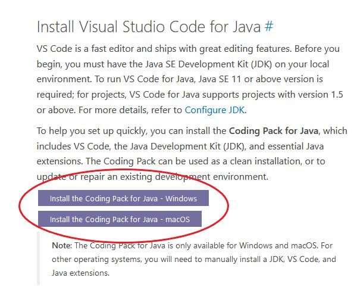
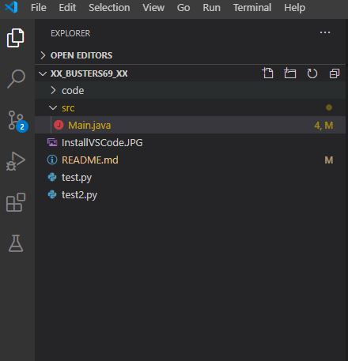
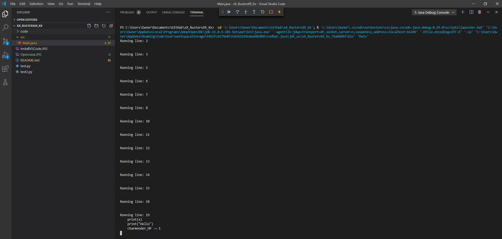

# xX_Busters69_Xx
---

## Explanation
Our program initializes a file called test2.py and then loads each line of the file into an element of a string array. We then iterate through the array and remove any of the lines from the array that begin with a '#' that represents a comment, and also removing any elements that are blank. We use the global integer to keep track of the current line. Our main function iterates through the remaining array and then calls executeLine() function, where each line is analyzed to see which keyword it contains, from the features that we were required to support. Once it matches a keyword, it then passes the entire line to its specific function. Once we initialize variables we store them all into a hashmap so that we can reference them as their values when necessary. In order to evaluate arithmatic, we first replace any variables with their value, and then call out to an external library to perform the computation. A working message from this library occurs in the console, but is just a warning. All of our if, while, and for statements use analyze the tabbing from the line of the statment itself, and counting the number of spaces preceding the keywork, and then counting the spaces on the following statements to see whether they are apart of that block. In each of these loops we use the i variable, and count the number of statements in the block with the variable j, and add it to i so that way we can skip over the block and not run each line twice. Our while statement iterates over their block and then checks the condition again. The for loop works very similarly, but also updates the control variable with each iteration. The while loop works as expected. The for loop itself works as expected, but we could not get our break statement to break the correct loop. The issue stemmed from the complexity in nesting with the if statements and for loops in the example file. 

## Known Issues
* Warning statement from evaluation library
* Break does not work in the nested for statement. 

## Team Members
* Chase White
* Jeremy Breese
* Jeffrey kerley
* Zach Snyder
* Ethan Schutzenhofer

## Requirements to Run our Interpreter
####  xX_Busters69_Xx requires the Visual studio code text editor to use our Interpreter. 
####  xX_Busters69_Xx also requires a JDK to run our program
#### xX_Busters69_Xx requires you to use macOS or Windows
#### We will show you how to install Visual Studio Code and the JDK for Visual studio code

## How to use our Interpreter
1. First download the Coding Pack for Java for VS code [here!](https://code.visualstudio.com/docs/languages/java) Scroll down until you find the "Install the Coding Pack for Java" button and click for your respective operating system

2. Then Open Visual Studio code and then open the xX_Busters69_Xx project folder.
3. Navigate to our src folder and open the Main.java file in the window.

4. Click F5 and Visual studio should open up a terminal and run the Program

